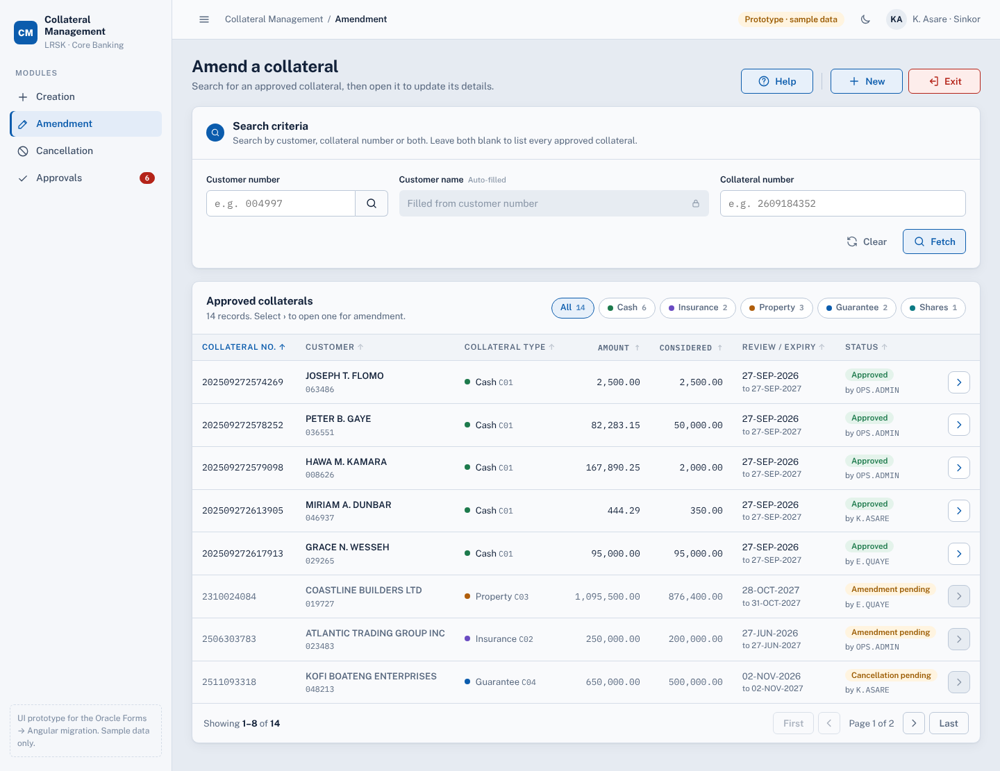
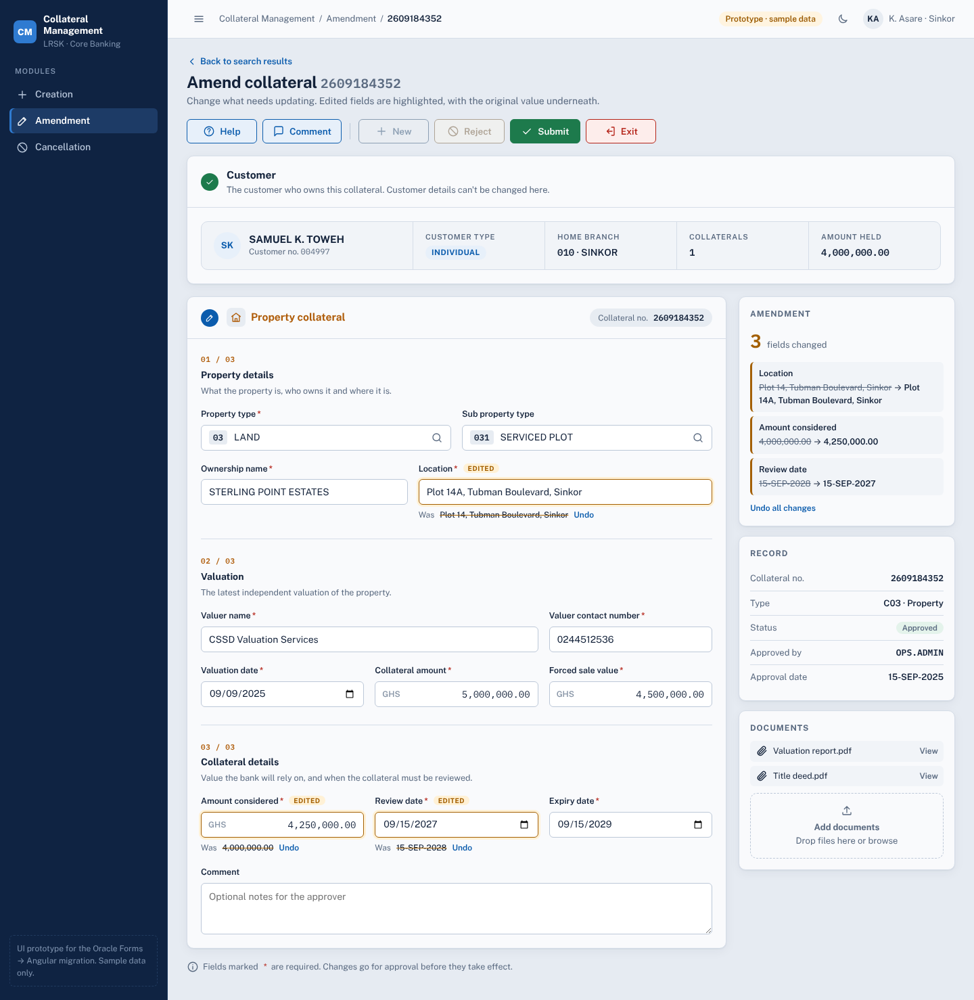
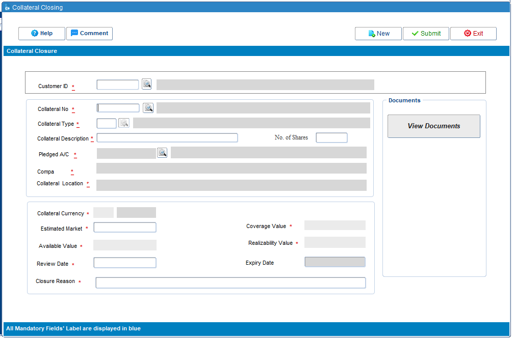
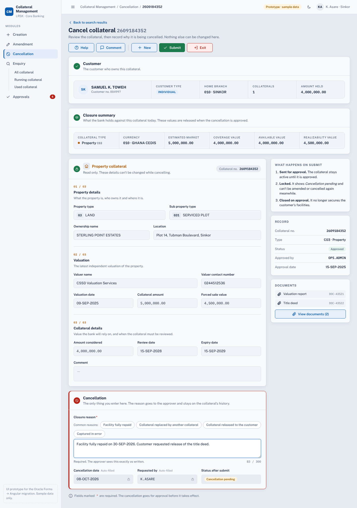
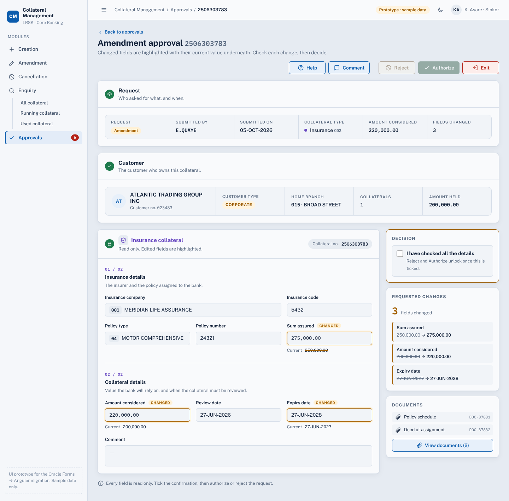
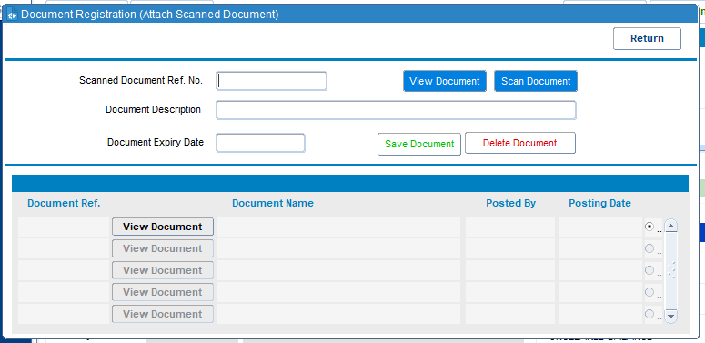
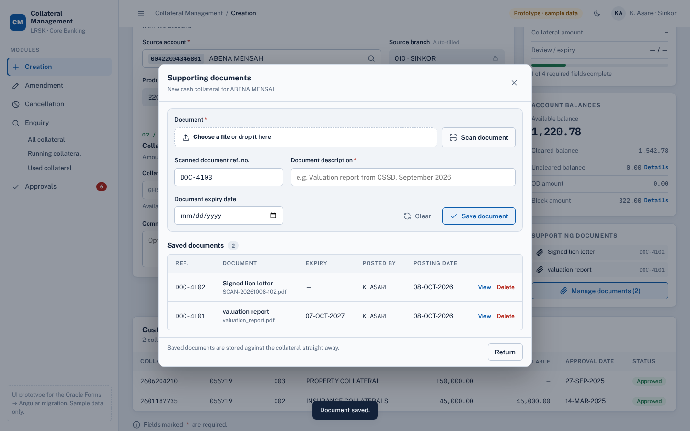
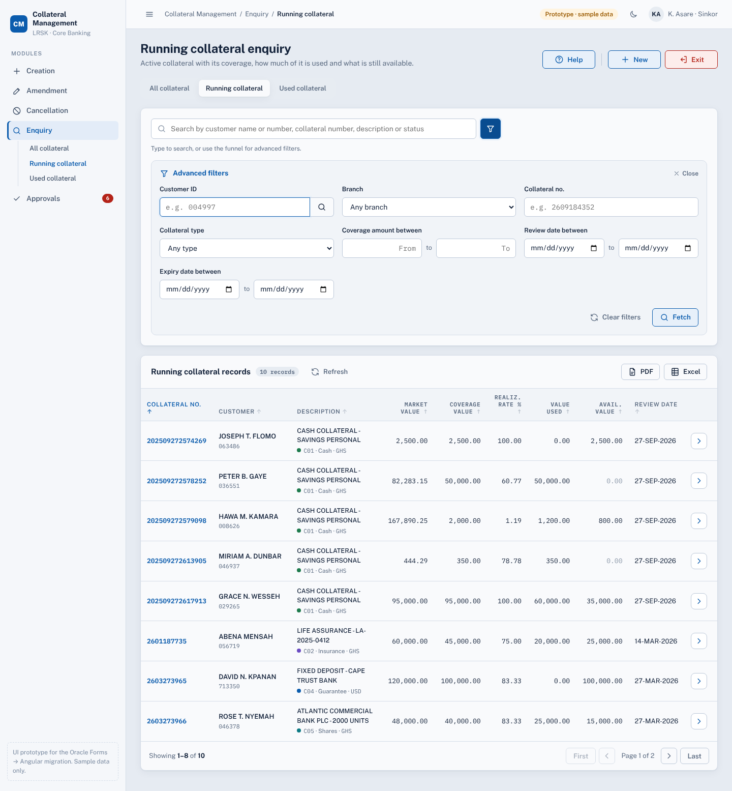
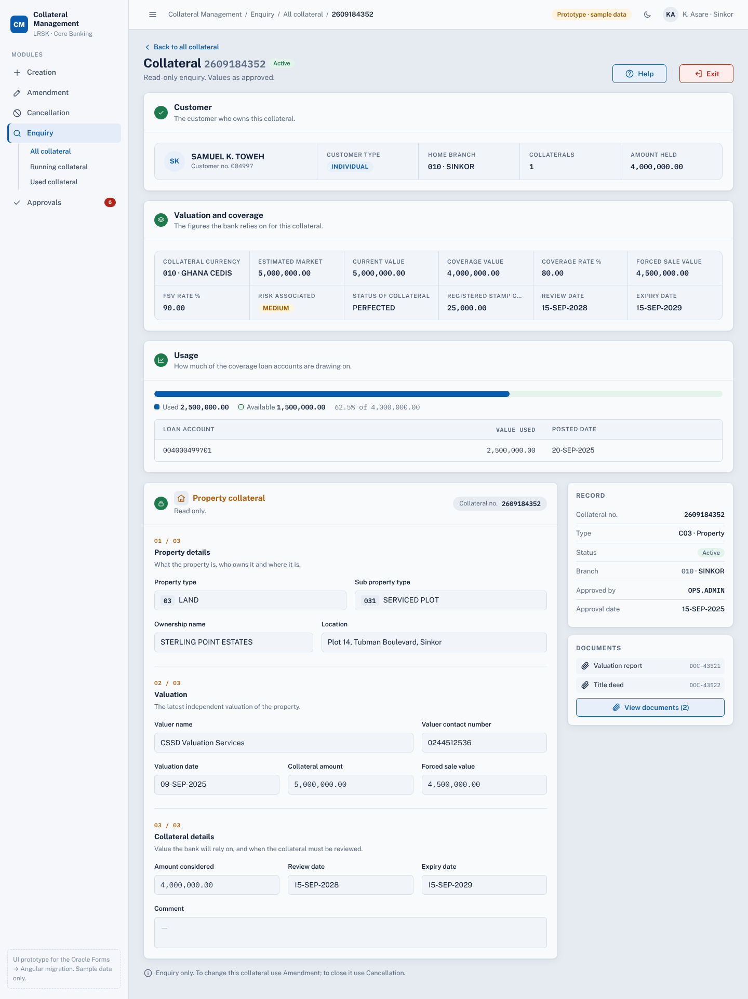

# Collateral Management: Oracle Forms → Angular

Design and documentation for moving the Collateral Management screens from Oracle Forms to Angular. Work goes module by module.

| Module | Status |
|---|---|
| Creation | Spec, UI prototype and flowchart from the PL/SQL ready ([flowchart](docs/creation/flowchart.md)). |
| Amendment | Spec, UI prototype and draft flow ready. Open questions listed in the spec. |
| Cancellation | Spec, UI prototype and draft flow ready. Uses the Amendment list with a read-only form and closure reason. |
| Approvals | Spec, UI prototype and draft flow ready. One queue for creation, amendment and cancellation requests. |
| Enquiry | Spec, UI prototype and draft flow ready. All, running and used collateral, with quick search, funnel filters and PDF / Excel. |

## Contents

```
screenshots/creation/          Current Oracle Forms screens (reference)
screenshots/amendment/
screenshots/cancellation/
screenshots/approval/
screenshots/enquiry/
design/prototype/index.html    Interactive UI prototype for all modules (open in any browser)
design/creation/screens/       Prototype screenshots for slides
design/amendment/screens/
design/cancellation/screens/
design/approval/screens/
design/enquiry/screens/
docs/creation/                 Functional spec and process flow per module
docs/amendment/
docs/cancellation/
docs/approval/
docs/enquiry/
docs/design-system.md          Colours, layout grid, action bar and components shared by all modules
```

## Before and after

| Oracle Forms | Angular design |
|---|---|
|  |  |
|  |  |
|  |  |
|  |  |
|  |  |
|  |  |
|  |  |
|  |  |

**Creation screens:** [documents](design/creation/screens/10-documents.png) · [insurance](design/creation/screens/02-insurance.png) · [property](design/creation/screens/03-property.png) · [guarantee](design/creation/screens/04-guarantee.png) · [shares](design/creation/screens/05-shares.png) · [validation](design/creation/screens/06-validation.png) · [lookup](design/creation/screens/07-lookup.png) · [submitted](design/creation/screens/08-submitted.png) · [blank](design/creation/screens/00-blank.png) · [mobile, dark](design/creation/screens/09-mobile-dark.png)

**Amendment screens:** [filtered and sorted](design/amendment/screens/02-filtered-sorted.png) · [search by customer](design/amendment/screens/03-search-customer.png) · [cash](design/amendment/screens/04-cash.png) · [insurance](design/amendment/screens/05-insurance.png) · [property](design/amendment/screens/06-property.png) · [guarantee](design/amendment/screens/07-guarantee.png) · [shares](design/amendment/screens/08-shares.png) · [validation](design/amendment/screens/10-validation.png) · [submitted](design/amendment/screens/11-submitted.png) · [pending in list](design/amendment/screens/12-list-pending.png) · [mobile, dark](design/amendment/screens/13-mobile-dark.png) · [desktop, dark](design/amendment/screens/14-desktop-dark.png)

**Cancellation screens:** [search list](design/cancellation/screens/01-search-list.png) · [cash](design/cancellation/screens/02-cash.png) · [insurance](design/cancellation/screens/03-insurance.png) · [property](design/cancellation/screens/04-property.png) · [guarantee](design/cancellation/screens/05-guarantee.png) · [shares](design/cancellation/screens/06-shares.png) · [confirm](design/cancellation/screens/08-confirm.png) · [submitted](design/cancellation/screens/09-submitted.png) · [pending in list](design/cancellation/screens/10-list-pending.png) · [mobile, dark](design/cancellation/screens/11-mobile-dark.png)

**Approval screens:** [queue](design/approval/screens/01-queue.png) · [amendments only](design/approval/screens/02-queue-amendments.png) · [creation, cash](design/approval/screens/03-creation-cash.png) · [creation, property](design/approval/screens/04-creation-property.png) · [cancellation](design/approval/screens/08-cancellation.png) · [authorized](design/approval/screens/06-authorized.png) · [reject reason](design/approval/screens/07-reject-reason.png) · [mobile, dark](design/approval/screens/09-mobile-dark.png)

**Enquiry screens:** [all](design/enquiry/screens/01-all.png) · [all, filters open](design/enquiry/screens/02-all-filters.png) · [all, filtered](design/enquiry/screens/03-all-filtered.png) · [running](design/enquiry/screens/04-running.png) · [used](design/enquiry/screens/06-used.png) · [details](design/enquiry/screens/07-detail-property.png) · [pending details](design/enquiry/screens/08-detail-pending.png) · [mobile, dark](design/enquiry/screens/09-mobile-dark.png)

## Using the prototype

Open `design/prototype/index.html` in a browser and switch modules from the sidebar (`#amendment`, `#cancellation`, `#approvals`, `#enquiry-all`, `#enquiry-running` or `#enquiry-used` in the address opens that screen directly).

**Creation** starts with sample customer `056719` and a cash collateral. Try other customer numbers (`048213`, `061104`, `072530`) or the search button, each collateral type tile, **Submit** with empty fields, then a complete submit.

**Amendment** lists 14 approved collaterals. Try searching for customer `004997`, the type chips, sorting a column, then **›** on a row. Change a few fields to see change tracking and **Undo**, then **Submit**.

**Cancellation** uses the same list. Open a record to see its read-only form, pick or type a closure reason, then **Submit** and confirm. The record is then locked in both Amendment and Cancellation.

**Approvals** starts with 6 sample requests, and everything you submit in the other modules joins the queue. Open one, tick *I have checked all the details*, then **Authorize** or **Reject** (with a reason). The result shows up across the modules: an authorized creation appears in Amendment, an authorized cancellation leaves the lists.

**Documents:** **Attach documents** in Creation (and **Manage documents** in Amendment) opens the documents modal. Choose or drop a file, or use **Scan document**, then **Save document**.

**Enquiry** has three tabs. Type in the search box, or open the funnel for advanced filters and **Fetch**; remove filters from the chips. Sort columns, export with **Excel**, and select **›** for the read-only details with valuation, usage and the type form.

All names, accounts and amounts are sample data.
