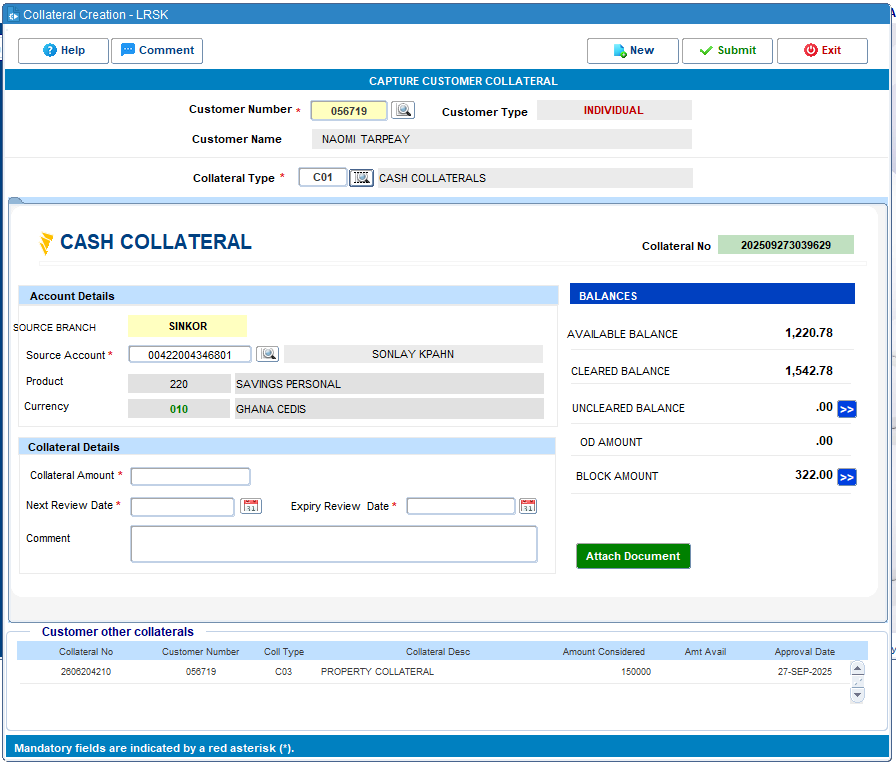
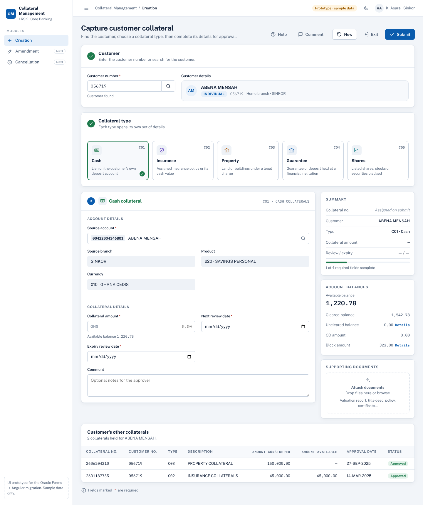

# Collateral Management: Oracle Forms → Angular

Design and documentation for moving the Collateral Management screens from Oracle Forms to Angular. Work goes module by module, starting with **Creation**.

| Module | Status |
|---|---|
| Creation | Spec, UI prototype and draft flow ready. Flowchart to be finalised from the PL/SQL. |
| Amendment | Planned |
| Cancellation | Planned |

## Contents

```
screenshots/creation/        Current Oracle Forms screens (reference)
design/creation/index.html   Interactive UI prototype (open in any browser)
design/creation/screens/     Screenshots of the prototype for slides
docs/creation/               Functional spec and process flow for Creation
docs/design-system.md        Colours, type and components shared by all modules
```

## Creation: before and after

| Oracle Forms | Angular design |
|---|---|
|  |  |

Other prototype screens: [insurance](design/creation/screens/02-insurance.png) · [property](design/creation/screens/03-property.png) · [guarantee](design/creation/screens/04-guarantee.png) · [shares](design/creation/screens/05-shares.png) · [validation](design/creation/screens/06-validation.png) · [lookup](design/creation/screens/07-lookup.png) · [submitted](design/creation/screens/08-submitted.png) · [blank](design/creation/screens/00-blank.png) · [mobile, dark](design/creation/screens/09-mobile-dark.png)

## Using the prototype

Open `design/creation/index.html` in a browser. It starts with a sample customer (`056719`) and a cash collateral, the same state as the reference screenshot. Try:

- Customer numbers `056719`, `048213`, `061104`, `072530`, or the search button.
- Each collateral type tile.
- **Submit** with empty fields to see validation, then complete a form to see the confirmation.
- **New** to clear the screen, **Help** and **Comment** for the side panels.

All names, accounts and amounts are sample data.
