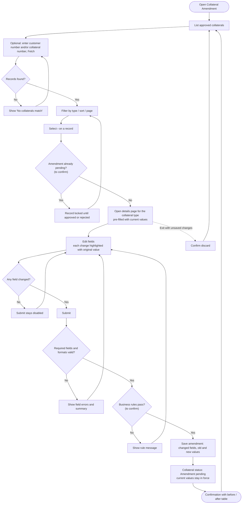

# Collateral Amendment: Process Flow (draft)

> **Status: draft.** Based on the screenshots only. It will be rewritten once the PL/SQL behind the Oracle Forms screens is reviewed. Nodes marked *(to confirm)* match the open questions in [`collateral-amendment.md` §6.2](collateral-amendment.md#62-to-confirm-against-the-plsql).

