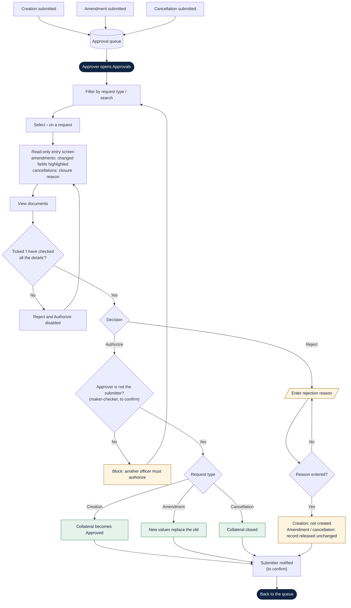

# Collateral Approval: Process Flow (draft)

> **Status: draft.** Based on the approval screenshots and the agreed design. It will be rewritten once the approval PL/SQL is reviewed. Nodes marked *(to confirm)* match [`collateral-approval.md` §5](collateral-approval.md#5-to-confirm-against-the-plsql).

