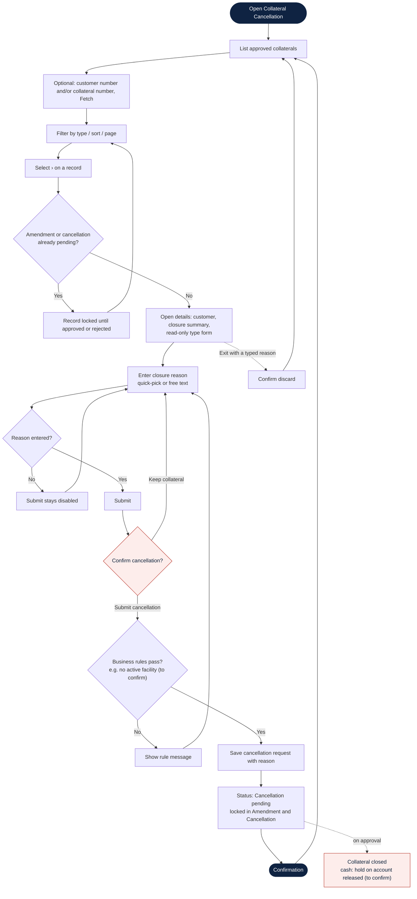

# Collateral Cancellation: Process Flow (draft)

> **Status: draft.** Based on the screenshot and the agreed design only. It will be rewritten once the PL/SQL behind the Oracle Forms closing screen is reviewed. Nodes marked *(to confirm)* match the open questions in [`collateral-cancellation.md` §6.2](collateral-cancellation.md#62-to-confirm-against-the-plsql).

