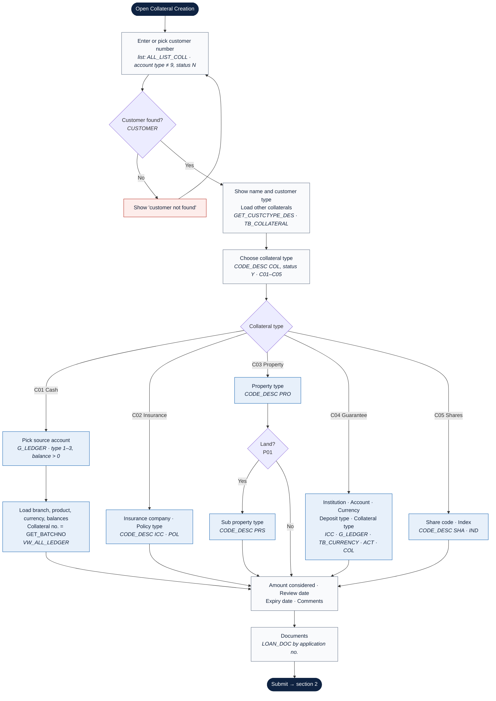
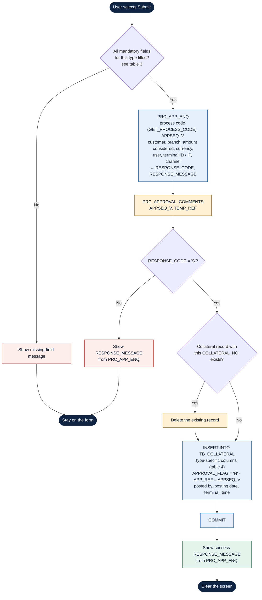

# Collateral Creation: Process Flow

> **Source:** the simplified PL/SQL behind the Oracle Forms *Collateral Creation* screen (customer and type lookups, the per-type lookups, and the five submit procedures). The submit procedure is the same for all five collateral types; only the mandatory fields and the stored columns differ.
>
> Rendered images for slides: [`flowchart-1-screen.png`](flowchart-1-screen.png) · [`flowchart-2-submit.png`](flowchart-2-submit.png)

## 1. Screen flow and data loading

What the screen loads at each step, and from where.

**Key:** dark = start/end · diamond = decision · blue = type-specific step. The italic line in each box names where its data comes from.

## 2. Submit procedure (same for all five types)

Amber steps are flagged in section 5.

## 3. Mandatory fields checked on submit

What each procedure checks for NOT NULL, compared with the red asterisks on the screen.

| Type | Checked by the PL/SQL | Differs from the screen |
|---|---|---|
| **C01 Cash** | Customer, collateral type, review date, expiry date, currency, amount considered, account number | Currency is checked, but it is filled automatically from the account |
| **C02 Insurance** | Customer, collateral type, review date, expiry date, amount considered, **account number**, insurance company, insurance code, policy type | **Account number** is checked but not on the screen. **Policy number** and **sum assured** are starred on the screen but not checked |
| **C03 Property** | Customer, collateral type, property type, amount, review date, location, forced sale value, ownership name, valuer name, valuer contact, valuation date, expiry date, amount considered | Matches. Sub property type is optional (only for land) |
| **C04 Guarantee** | Customer, collateral type, company, number of months, currency, deposit type, interest rate, amount, review date, folio no., folio start, folio end, amount considered, expiry date | **Account number** and **collateral type** are starred on the screen but not checked |
| **C05 Shares** | Customer, collateral type, security code, index, market value, number of shares, folio no., folio start, folio end, amount, amount considered, review date, expiry date | Matches |

## 4. What each type stores in `TB_COLLATERAL`

Every insert also writes `COLLATERAL_NO`, `COLL_TYPE`, `COLL_DESC`, `CUSTOMER_NUMBER`, `AMOUNT`, `AMOUNT_CONSIDERED`, `REVIEW_DATE`, `EXP_DATE`, `COMMENTS`, `BRANCH_CODE`, `ACCOUNT_NUMBER`, `APPROVAL_FLAG = 'N'`, `APP_REF = APPSEQ_V` and the posting audit columns.

| Type | Type-specific columns |
|---|---|
| **C01 Cash** | `CURRENCY`, `AC_DESC`, `AMOUNT` = account balance, `AMT_AVAIL`, `PLEDGE_ACCOUNT` = account number |
| **C02 Insurance** | `POLICY_TYPE`, `INS_COMPANY`, `INS_CODE`, `POLICY_NO`. Posting date from `GET_POSTINGDATE` |
| **C03 Property** | As shared, the column list is the insurance one (`POLICY_TYPE`, `INS_COMPANY`, `INS_CODE`, `POLICY_NO`). See finding 3 |
| **C04 Guarantee** | `COMPANY`, `CURRENCY`, `DEPOSITE_TYPE`, `NO_OF_MONTHS`, `INTEREST_RATE`, `FOLIO_NO`, `FOLIO_START_NO`, `FOLIO_END_NO`, `BRANCH`, `PROPERTY_TYPE` = the guarantee's collateral type |
| **C05 Shares** | `SEC_CODE`, `INDEX_NO`, `NO_SHARE`, `MARKET_VALUE`, `FOLIO_NO`, `FOLIO_START_NO`, `FOLIO_END_NO` |

## 5. Findings to check before migrating

These come from reading the simplified code. Some may be simplification artefacts, so each one needs a quick check against the full procedure.

| # | Finding | Why it matters for Angular |
|---|---|---|
| 1 | **Delete-then-insert.** If a record with the same collateral number exists, it is deleted before the insert. | Could silently overwrite an existing collateral if a number is reused. The API should reject duplicates or update explicitly, inside one transaction. |
| 2 | **Approval comments are saved before the response check.** `PRC_APPROVAL_COMMENTS` runs even when `PRC_APP_ENQ` fails. | May leave comments attached to an approval request that was never raised. |
| 3 | **Property insert lists insurance columns.** Location, valuer, valuation date, forced sale value, ownership name and property type are validated but not in the shared `INSERT` column list (which also uses `COLLATERAL_NO1`). | Confirm where property details are stored before designing the API and table mapping. |
| 4 | **Commit boundaries.** `PRC_APP_ENQ` raises the approval request before the insert. If the insert fails, it is unclear whether the approval request is rolled back. | The new API should create the approval request and the collateral in one transaction. |
| 5 | **Screen and code disagree on mandatory fields** (table 3). | Angular validation should follow one agreed list. |
| 6 | **Financial institutions use the insurance company list** (`CODE_DESC` type `ICC`). | Confirm whether guarantees should have their own institution list. |
| 7 | **No business-rule checks in the shared code.** Nothing compares amount considered with the account balance, market value or sum assured, or checks review date < expiry date. | Either these live inside `PRC_APP_ENQ`, or they don't exist yet and should be agreed. |
| 8 | **Posting date differs.** Insurance uses `GET_POSTINGDATE`, the other types use the system date. | Pick one rule for all types. |

## 6. Questions answered by the PL/SQL

These close several open questions in [`collateral-creation.md` §5.2](collateral-creation.md#52-to-confirm-against-the-plsql).

| Question | Answer from the code |
|---|---|
| Q1 When is the collateral number generated? | For cash, when the source account is selected (`GET_BATCHNO` in the account-details query). The source for the other types is not in the shared code. |
| Q5 Does sub property type depend on property type? | Yes. It is only offered for **Land** (`P01`), from `CODE_DESC` type `PRS`. |
| Q5 Does the guarantee account depend on the institution? | No. The account list is the customer's own accounts in `G_LEDGER` (types 1–3). |
| Q8 What does the toolbar Comment store? | Approval comments, saved by `PRC_APPROVAL_COMMENTS` against the approval sequence (`APPSEQ_V`, `TEMP_REF`). |
| Q9 What happens after submit? | `PRC_APP_ENQ` raises an approval request. The collateral is saved with `APPROVAL_FLAG = 'N'` and linked by `APP_REF`. On success the screen is cleared. |
| Which customers can be picked? | Only those in `ALL_LIST_COLL` whose account type is not 9 and whose account status is `N`. |
| Which accounts can secure a cash collateral? | The customer's type 1, 2 or 3 accounts with a balance above zero. |
