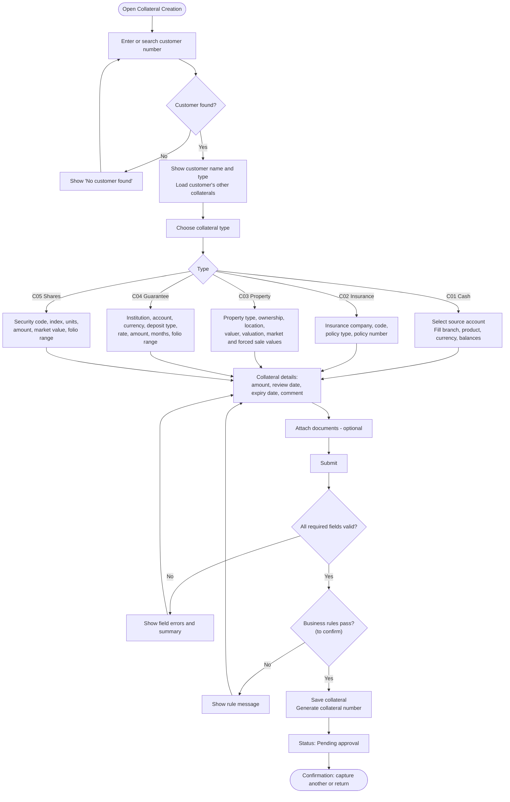

# Collateral Creation: Process Flow (draft)

> **Status: draft.** This flow is based only on the screenshots. It will be rewritten once the PL/SQL behind the Oracle Forms screen is reviewed. Nodes marked *(to confirm)* match the open questions in [`collateral-creation.md` §5.2](collateral-creation.md#52-to-confirm-against-the-plsql).

