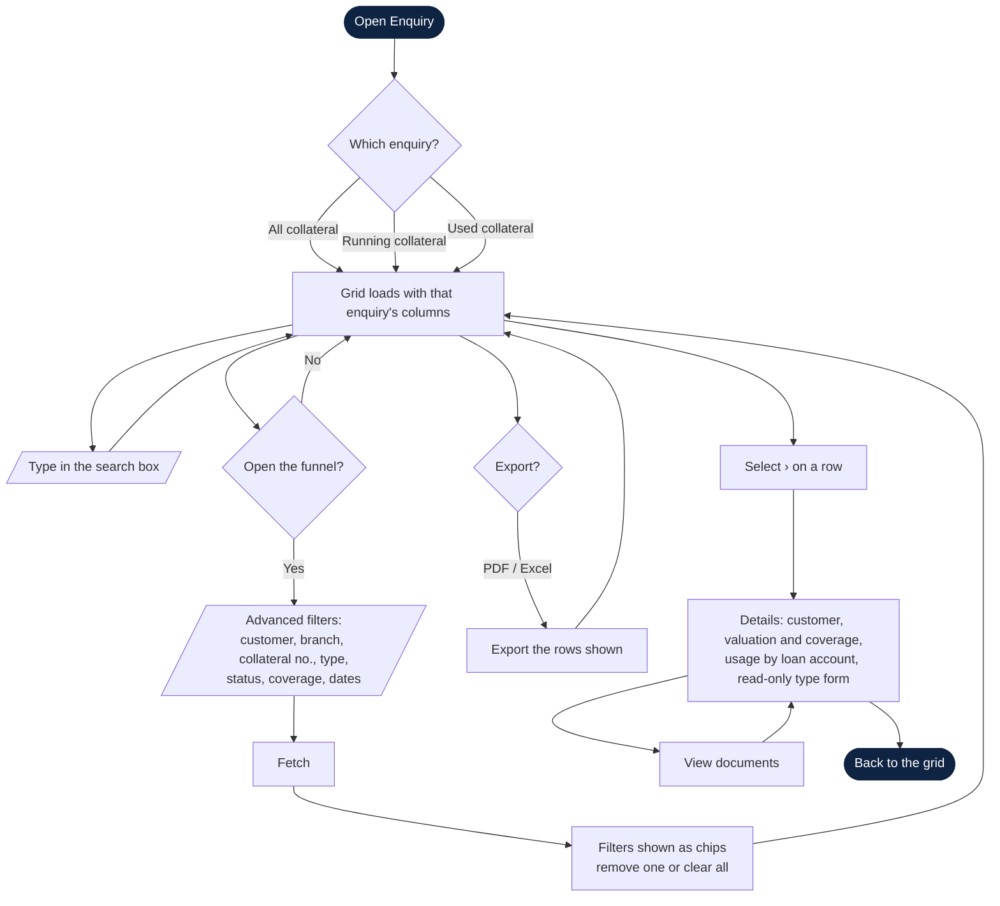

# Collateral Enquiry: Process Flow (draft)

> **Status: draft.** Based on the enquiry screenshots and the agreed design. It will be rewritten once the enquiry PL/SQL is reviewed.

```mermaid
flowchart TD
    A([Open Enquiry]) --> K{Which enquiry?}
    K -- All collateral --> L
    K -- Running collateral --> L
    K -- Used collateral --> L
    L[Grid loads with that enquiry's columns] --> Q[/Type in the search box/]
    Q --> L
    L --> F{Open the funnel?}
    F -- Yes --> P[/Advanced filters:<br/>customer, branch, collateral no., type,<br/>status, coverage, dates/]
    P --> FE[Fetch]
    FE --> CH[Filters shown as chips<br/>remove one or clear all]
    CH --> L
    F -- No --> L
    L --> X{Export?}
    X -- PDF / Excel --> XP[Export the rows shown] --> L
    L --> O[Select › on a row]
    O --> D[Details: customer, valuation and coverage,<br/>usage by loan account, read-only type form]
    D --> DD[View documents] --> D
    D --> B([Back to the grid])

    classDef term fill:#0F2342,stroke:#0F2342,color:#FFFFFF
    class A,B term
```
